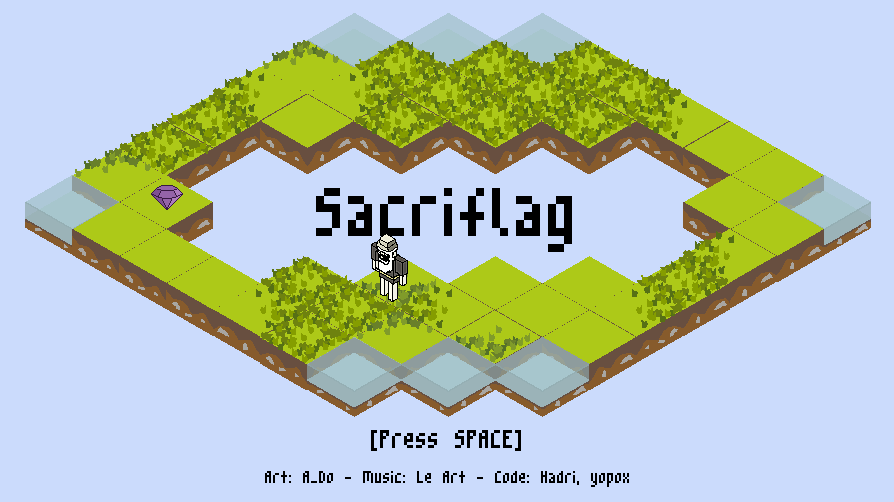

# LD43

   

    

[Page du projet sur le site Ludum Dare.](https://ldjam.com/events/ludum-dare/43/sacriflag)

Le thème de cette game jam est "sacrifices must be made".

Idée du jeu :

- Le joueur dispose d'un capital de points à répartir entre ses différentes caractéristiques.
- Au cours de la partie, le joueur est amené à rencontrer des obstacles. Pour les franchir il faut un minimum de points dans une ou plusieurs caractéristiques.
- Le joueur peut, à tout moment, reinitialiser ses carac et répartir à nouveau ses points. Cependant cette opérarion coûte un nombre de points (idée de sacrifice).

# License

Ce jeu est publié sous la license CC0 1.0.

La police d'écriture utilisée a été crée par Daniel Linssen.